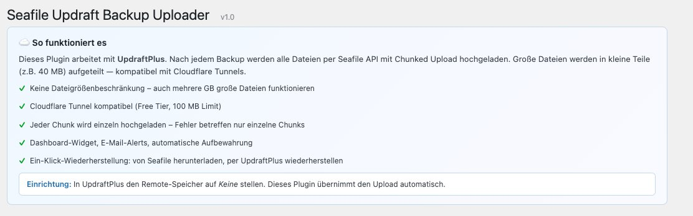
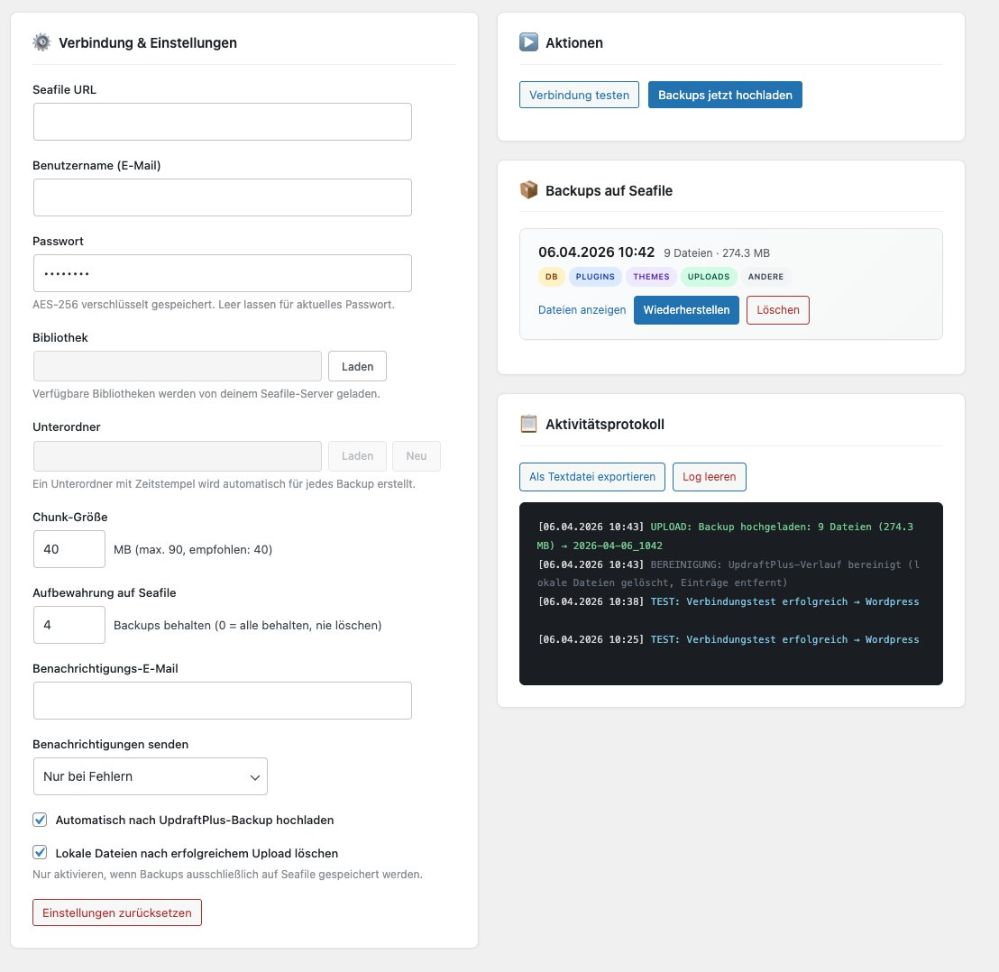

# Seafile Updraft Backup Uploader

**WordPress plugin to upload UpdraftPlus backups to Seafile via chunked native API — bypasses the Cloudflare Tunnel 100 MB upload limit that breaks WebDAV.**

*Keywords: WordPress, UpdraftPlus, Seafile, backup, Cloudflare Tunnel, chunked upload, self-hosted, 100MB limit, WebDAV alternative*

---

WordPress-Plugin: Lädt UpdraftPlus-Backups automatisch per Seafile API mit Chunked Upload hoch. Umgeht WebDAV- und Cloudflare-Tunnel-Limits (100 MB).




## Was ist das?

UpdraftPlus erstellt Backups — dieses Plugin übernimmt den Upload auf deinen Seafile-Server. Anders als WebDAV werden große Dateien in kleine Chunks aufgeteilt (z.B. 40 MB), sodass auch Cloudflare Tunnels (100 MB Limit) kein Problem sind.

**Warum nicht WebDAV?**
- WebDAV auf Seafile unterstützt kein Chunked Upload
- Dateien größer als das Proxy-Limit scheitern
- Dieses Plugin nutzt die gleiche API wie Seafile selbst

## Features

- Chunked Upload via Seafile API (5–90 MB pro Chunk)
- Automatischer Upload nach jedem UpdraftPlus-Backup
- Bibliothek/Unterordner-Picker per Dropdown (lädt direkt von Seafile)
- Backup-Browser mit Typ-Badges (DB, Plugins, Themes, Uploads, Andere)
- Ein-Klick-Wiederherstellung von Seafile zurück zu UpdraftPlus
- Automatische Retention (z.B. nur letzte 4 Backups behalten)
- Aktivitätsprotokoll mit Export (Upload, Löschen, Restore, Bereinigung)
- Echtzeit-Fortschrittsbalken für Upload und Wiederherstellung
- Dashboard-Widget mit letztem Backup-Status
- E-Mail-Benachrichtigungen bei Fehler
- AES-256-CBC Passwortverschlüsselung (zufälliger IV, OpenSSL-Pflicht)
- Komplett deutsche Benutzeroberfläche

## Voraussetzungen

- WordPress 6.0+
- PHP 7.4+ mit OpenSSL-Erweiterung
- [UpdraftPlus](https://updraftplus.com/) (Free oder Premium)
- Seafile Server mit API-Zugang

## Installation

1. ZIP herunterladen unter [Releases](https://github.com/malziland/Seafile-Updraft-Backup-Uploader/releases)
2. WordPress Admin → **Plugins → Installieren → Plugin hochladen**
3. Aktivieren
4. **Einstellungen → Seafile Backup**

## Einrichtung

1. Seafile URL, Benutzername und Passwort eingeben
2. **Laden** klicken → Bibliothek aus Dropdown wählen
3. Unterordner wählen oder **Neu** klicken um einen zu erstellen
4. In UpdraftPlus den Remote-Speicher auf **Keine** stellen
5. **Einstellungen speichern**

Das Plugin übernimmt den Upload automatisch nach jedem UpdraftPlus-Backup.

## Wiederherstellung

**Seite funktioniert noch:**
1. Seafile Backup → Backup auswählen → **Wiederherstellen**
2. Dateien werden ins UpdraftPlus-Verzeichnis heruntergeladen
3. In UpdraftPlus → **Lokalen Ordner neu scannen** → normal wiederherstellen

**Seite komplett kaputt:**
1. WordPress + UpdraftPlus neu installieren
2. Plugin installieren → Seafile-Verbindung einrichten
3. Backup wiederherstellen → UpdraftPlus Restore

## Architektur

```
seafile-updraft-backup-uploader/
├── seafile-updraft-backup-uploader.php   — Bootstrap (Konstanten, Autoload, Activation-Hooks)
├── includes/
│   ├── class-sbu-plugin.php              — Hauptlogik (Admin, AJAX, Queue-Engine)
│   ├── class-sbu-crypto.php              — AES-256-CBC Password-Encryption
│   └── class-sbu-seafile-api.php         — Stateless REST-Client für Seafile
├── views/
│   └── admin-page.php                    — Template der Einstellungsseite
├── assets/
│   ├── css/admin.css                     — Admin-Styles
│   └── js/admin.js                       — Admin-UI-Script
├── languages/                            — Übersetzungsdateien (DE/EN)
├── tests/                                — PHPUnit + Brain\Monkey Test-Suite
├── readme.txt                            — WordPress.org Plugin-Header
├── LICENSE                               — MIT
├── ARCHITECTURE.md                       — State-Machine, Queue, Lock-Modell
├── CHANGELOG.md                          — Versionshistorie
├── CONTRIBUTING.md                       — Beitragsrichtlinien
└── SECURITY.md                           — Sicherheitsrichtlinie
```

**Kernkomponenten:**
- `SBU_Crypto` — AES-256-CBC mit zufälligem IV pro Vorgang, Legacy-IV-Migration
- `SBU_Seafile_API` — Auth, Library-Resolve, Upload-Link, Streaming-Download, Directory-Ops
- `SBU_Plugin` — Admin-Seite, 20 AJAX-Handler (Nonce + `manage_options`) + 1 öffentlicher Cron-Endpoint (per-site Secret-Key, `hash_equals`), Queue-Engine mit Chunked-Upload, Pause/Resume, Crash-Detection, Retry-Backoff, Aktivitätsprotokoll

Die Queue-Logik, das Locking-Modell und die State-Machine (uploading ↔ paused, → aborted/error/done) sind in [ARCHITECTURE.md](ARCHITECTURE.md) dokumentiert.

## Sicherheit

- Alle AJAX-Endpoints erfordern `manage_options` + Nonce-Verifizierung
- Passwörter mit AES-256-CBC verschlüsselt (zufälliger IV pro Vorgang)
- OpenSSL-Pflicht — kein Klartext-Fallback
- Path-Traversal-Schutz auf allen Benutzereingaben
- Genau ein öffentlicher Endpoint (`sbu_cron_ping`) — per-site Secret-Key, konstant-zeitiger Vergleich via `hash_equals()`
- SSL-Verifizierung bei Seafile-API-Kommunikation

Sicherheitslücken bitte an **info@malziland.at** melden — siehe [SECURITY.md](SECURITY.md).

## Credits

malziland — learning | training | consulting

## Lizenz

MIT — siehe [LICENSE](LICENSE)
