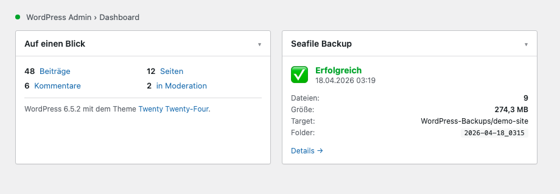

# Seafile Updraft Backup Uploader

**WordPress plugin to upload UpdraftPlus backups to Seafile via chunked native API — bypasses the Cloudflare Tunnel 100 MB upload limit that breaks WebDAV.**

*Keywords: WordPress, UpdraftPlus, Seafile, backup, Cloudflare Tunnel, chunked upload, self-hosted, 100MB limit, WebDAV alternative*

---

WordPress-Plugin: Lädt UpdraftPlus-Backups automatisch per Seafile API mit Chunked Upload hoch. Umgeht WebDAV- und Cloudflare-Tunnel-Limits (100 MB).




*Die Screenshots zeigen das Plugin mit Demo-Daten (`seafile.example.com`, Library `WordPress-Backups`).*

## Was ist das?

UpdraftPlus erstellt Backups — dieses Plugin übernimmt den Upload auf deinen Seafile-Server. Anders als WebDAV werden große Dateien in kleine Chunks aufgeteilt (z.B. 40 MB), sodass auch Cloudflare Tunnels (100 MB Limit) kein Problem sind.

**Warum nicht WebDAV?**
- WebDAV auf Seafile unterstützt kein Chunked Upload
- Dateien größer als das Proxy-Limit scheitern
- Dieses Plugin nutzt die gleiche API wie Seafile selbst

## Features

- Chunked Upload via Seafile API (5–90 MB pro Chunk)
- Automatischer Upload nach jedem UpdraftPlus-Backup
- Bibliothek/Unterordner-Picker per Dropdown (lädt direkt von Seafile)
- Backup-Browser mit Typ-Badges (DB, Plugins, Themes, Uploads, Andere)
- Ein-Klick-Wiederherstellung von Seafile zurück zu UpdraftPlus
- Automatische Retention (z.B. nur letzte 4 Backups behalten)
- Aktivitätsprotokoll mit Export (Upload, Löschen, Restore, Bereinigung)
- Echtzeit-Fortschrittsbalken für Upload und Wiederherstellung
- Dashboard-Widget mit letztem Backup-Status
- E-Mail-Benachrichtigungen bei Fehler
- AES-256-CBC Passwortverschlüsselung (zufälliger IV, OpenSSL-Pflicht)
- Komplett deutsche Benutzeroberfläche

## Voraussetzungen

- WordPress 6.0+
- PHP 8.2+ mit OpenSSL-Erweiterung (PHP 8.2, 8.3 und 8.4 werden per CI getestet)
- [UpdraftPlus](https://updraftplus.com/) (Free oder Premium)
- Seafile Server mit API-Zugang

## Installation

1. ZIP herunterladen unter [Releases](https://github.com/malziland/Seafile-Updraft-Backup-Uploader/releases)
2. WordPress Admin → **Plugins → Installieren → Plugin hochladen**
3. Aktivieren
4. **Einstellungen → Seafile Backup**

## Einrichtung

1. Seafile URL, Benutzername und Passwort eingeben
2. **Laden** klicken → Bibliothek aus Dropdown wählen
3. Unterordner wählen oder **Neu** klicken um einen zu erstellen
4. In UpdraftPlus den Remote-Speicher auf **Keine** stellen
5. **Einstellungen speichern**

Das Plugin übernimmt den Upload automatisch nach jedem UpdraftPlus-Backup.

## Wiederherstellung

**Seite funktioniert noch:**
1. Seafile Backup → Backup auswählen → **Wiederherstellen**
2. Dateien werden ins UpdraftPlus-Verzeichnis heruntergeladen
3. In UpdraftPlus → **Lokalen Ordner neu scannen** → normal wiederherstellen

**Seite komplett kaputt:**
1. WordPress + UpdraftPlus neu installieren
2. Plugin installieren → Seafile-Verbindung einrichten
3. Backup wiederherstellen → UpdraftPlus Restore

## Architektur

```
seafile-updraft-backup-uploader/
├── seafile-updraft-backup-uploader.php   — Bootstrap (Konstanten, Autoload, Activation-Hooks)
├── includes/
│   ├── class-sbu-plugin.php              — Haupt-Controller: Admin-Init, Settings, Lifecycle
│   ├── class-sbu-queue-engine.php        — Tick-Gate, Queue-Lock, Stale-Lock-Recovery
│   ├── class-sbu-activity-log.php        — Aktivitätsprotokoll (Ring-Buffer, Retention)
│   ├── class-sbu-mail-notifier.php       — E-Mail-Benachrichtigungen (Erfolg/Fehler)
│   ├── class-sbu-seafile-api.php         — Stateless REST-Client für Seafile
│   ├── class-sbu-crypto.php              — AES-256-CBC Password-Encryption
│   ├── trait-sbu-upload-flow.php         — Upload-Queue, Chunked-Upload, Retry/Backoff
│   ├── trait-sbu-restore-flow.php        — Restore-Queue, paralleler Range-Download
│   └── trait-sbu-admin-ajax.php          — 20 AJAX-Handler (Admin) + 1 öffentlicher Cron-Ping
├── views/
│   └── admin-page.php                    — Template der Einstellungsseite
├── assets/
│   ├── css/admin.css                     — Admin-Styles
│   └── js/admin.js                       — Admin-UI-Script
├── languages/                            — Übersetzungsdateien (DE/EN, .pot-Template)
├── tests/                                — PHPUnit 11 + Brain\Monkey Test-Suite (121 Tests)
├── scripts/                              — regen-pot.sh, check-i18n.sh
├── readme.txt                            — WordPress.org Plugin-Header
├── LICENSE                               — MIT
├── ARCHITECTURE.md                       — State-Machine, Queue, Lock-Modell
├── CHANGELOG.md                          — Versionshistorie
├── CONTRIBUTING.md                       — Beitragsrichtlinien, Dev-Setup, Release-Prozess
└── SECURITY.md                           — Threat-Model, Disclosure-Process
```

**Kernkomponenten:**
- `SBU_Plugin` — Haupt-Controller. Bindet die drei Traits ein und orchestriert Admin-Init, Einstellungen, Queue-Bootstrap sowie Crash-Detection.
- `SBU_Queue_Engine` — Tick-Gate (`next_allowed_tick_ts`-Logik), `add_option`-basiertes Queue-Lock mit Stale-Lock-Recovery.
- `SBU_Activity_Log` — Aktivitätsprotokoll als gekappter Ring-Buffer mit konfigurierbarer Retention und täglichem Cron-Prune.
- `SBU_Mail_Notifier` — E-Mail-Benachrichtigungen für Erfolg / Fehler / nur Fehler; keine Templates im Haupt-Controller.
- `SBU_Seafile_API` — Stateless REST-Client: Auth-Token (mit Transient-Cache), Library-Resolve, Upload-/Download-Link, paralleler `curl_multi`-Range-Download, Directory-Ops.
- `SBU_Crypto` — AES-256-CBC mit zufälligem IV pro Vorgang. Legacy-IV-Migration erkennt alte Formate und re-verschlüsselt beim nächsten Save.
- `SBU_Upload_Flow` / `SBU_Restore_Flow` / `SBU_Admin_Ajax_Controller` — Traits, die die Upload-Queue-Mechanik, Restore-Queue-Mechanik und AJAX-Endpunkte in `SBU_Plugin` einhängen.

**Öffentliche Oberfläche:** 20 Admin-AJAX-Endpunkte (alle mit `manage_options` + Nonce) und genau **ein** öffentlicher Endpunkt `sbu_cron_ping` (per-site 32-char Secret-Key, `hash_equals()`-Vergleich).

Die Queue-Logik, das Locking-Modell und die State-Machine (uploading ↔ paused, → aborted/error/done) sind in [ARCHITECTURE.md](ARCHITECTURE.md) dokumentiert.

## Entwicklung und Tests

```bash
git clone https://github.com/malziland/Seafile-Updraft-Backup-Uploader.git
cd Seafile-Updraft-Backup-Uploader
composer install                                 # PHP 8.2+ erforderlich

./vendor/bin/phpunit                             # 121 Tests / 333 Assertions
./vendor/bin/phpcs --extensions=php \            # WordPress Coding Standards
    --ignore=vendor,languages,assets,tests,.github,scripts .
./vendor/bin/phpstan analyse --level=5 \         # statische Analyse
    --memory-limit=1G --no-progress
```

Die CI-Pipeline (`.github/workflows/ci.yml`) fährt alle drei Gates auf der PHP-Matrix 8.2 / 8.3 / 8.4 und prüft zusätzlich per Gitleaks auf eingecheckte Geheimnisse. Jeder Push auf `main`, `feature/**` und `fix/**` sowie jeder Pull Request lösen die Pipeline aus — rotes CI blockt das Release.

Der Release-Prozess (Version-Bump → ZIP → Commit → Tag → GitHub-Release mit ZIP-Asset) ist in [CONTRIBUTING.md](CONTRIBUTING.md) beschrieben.

## Sicherheit

- Alle AJAX-Endpoints erfordern `manage_options` + Nonce-Verifizierung
- Passwörter mit AES-256-CBC verschlüsselt (zufälliger IV pro Vorgang)
- OpenSSL-Pflicht — kein Klartext-Fallback
- Path-Traversal-Schutz auf allen Benutzereingaben
- Genau ein öffentlicher Endpoint (`sbu_cron_ping`) — per-site Secret-Key, konstant-zeitiger Vergleich via `hash_equals()`
- SSL-Verifizierung bei Seafile-API-Kommunikation

Sicherheitslücken bitte an **info@malziland.at** melden — siehe [SECURITY.md](SECURITY.md).

## Credits

malziland — learning | training | consulting

## Lizenz

MIT — siehe [LICENSE](LICENSE)
